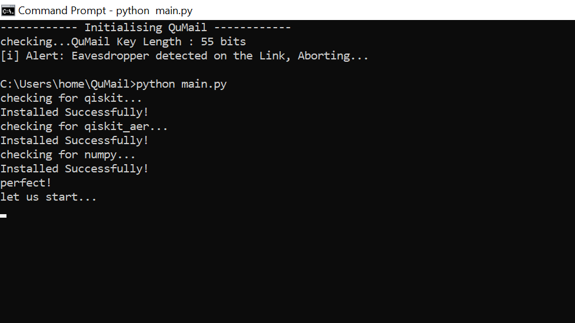
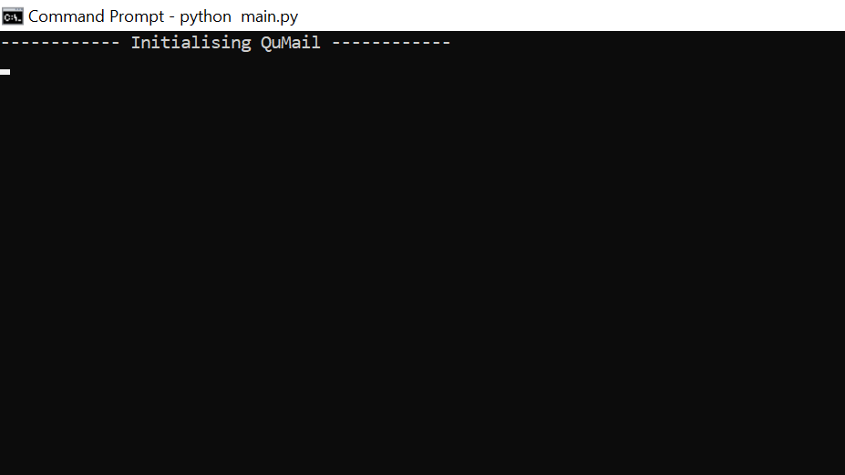
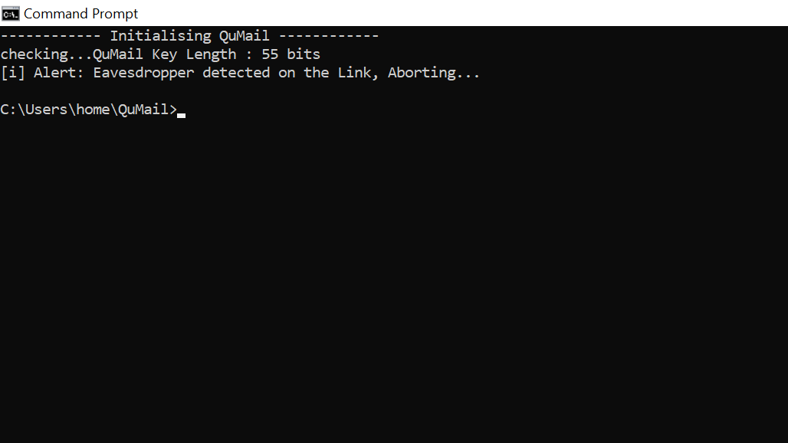
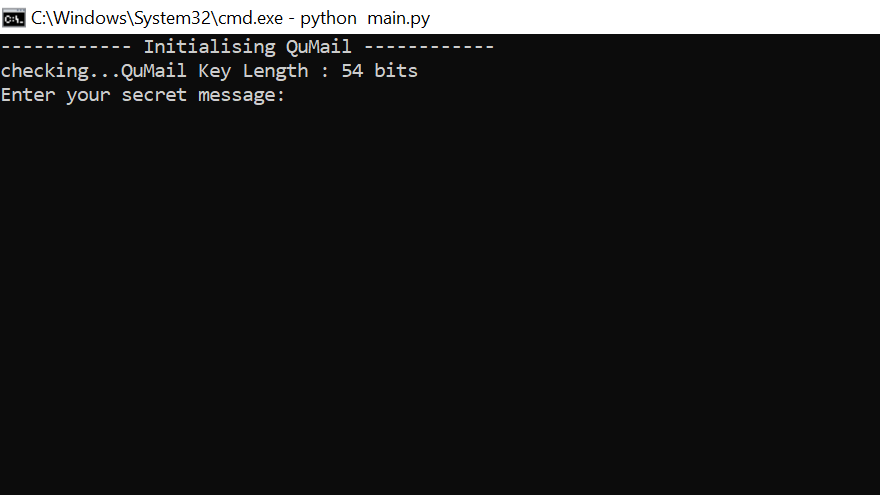
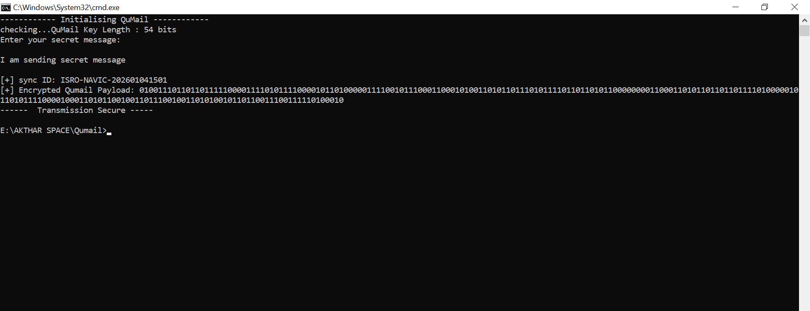

# QuMail: Quantum-Safe Messaging System 

QuMail is a secure communication platform inspired by **ISRO's SAQTI mission**. It uses **Quantum Key Distribution (QKD)** to generate unbreakable encryption keys that are immune to eavesdropping and future quantum computer attacks.

##  How it Works
QuMail operates on the principle of **Quantum Mechanics**. Unlike standard email which uses math-based encryption, QuMail uses the **BB84 Protocol** to share a secret key via simulated polarized photons.


### 1. Quantum Handshake (The Start)
When you launch `main.py`, the system initiates a handshake. Alice (the sender) and Bob (the receiver) exchange qubits using **IBM Qiskit**. They only keep the bits where their measurement bases match.

**Expected Output:**
> *Quantum Key Established: 64 bits*
> *Link Secure. QBER: 0.0%*

### 2. XOR Encryption (The Lock)
Once the key is shared, QuMail uses a **One-Time Pad (OTP)** cipher. This transforms your plain text into a binary ciphertext that is mathematically impossible to crack without the quantum key.


### 3. Decryption (The Recovery)
On the receiving end, the same Quantum Key is applied to the ciphertext to perfectly reconstruct the original message.

---

##  Getting Started

### Prerequisites
- Python 3.8+
- `pip install qiskit qiskit-aer numpy psutil`

### Installation
```bash
git clone https://github.com/gytdrop/QuMail.git
cd QuMail
python main.py
```
##  System Workflow

### Step 1: Quantum Handshake
The system uses Qiskit to simulate a quantum channel. 




### The initialization




### if there is someone listening



### Step 2: XOR Encryption
Once the key is verified, we apply a One-Time Pad (OTP) cipher.
### when no eavesdropper


### the message is transmitted


### Step 3: NavIC Sync
The session is timestamped using satellite-inspired synchronization.


## Security Warning & Simulation Limits

This project is a **Quantum Simulation** designed for educational and research purposes. It is important to distinguish between this software model and a physical QKD deployment.

### Simulation vs. Real Hardware (ISRO SAQTI)

| Feature | QuMail Simulation (This Repo) | Physical QKD (ISRO/SAC) |
| :--- | :--- | :--- |
| **Qubits** | Mathematical objects in Qiskit | Single Photons (Light particles) |
| **Channel** | Local CPU/Standard Internet | Fiber Optic or Satellite Laser Link |
| **Eavesdropping** | Detected by software logic | Detected by the Laws of Physics |
| **Randomness** | Pseudo-random numbers (Numpy) | True Quantum Randomness (QRNG) |
| **Cloning** | Theoretically possible to "copy" variables | Physically impossible (No-Cloning Theorem) |


### Real-World Threat Model
In a real-world scenario, the "Quantum Channel" is a physical beam of light. If a hacker (Eve) intercepts a photon, the act of measuring it changes its state forever. In our simulation, we mimic this behavior using Qiskit's `Aer` simulator to ensure the logic of the **BB84 Protocol** is preserved.

---
>The project is still incomplete.
>It is a Quantum seeding cryptography encryption
>The reciever's algorithm is still pending
>The QuMail will be updated soon.
>Stay Tune !
